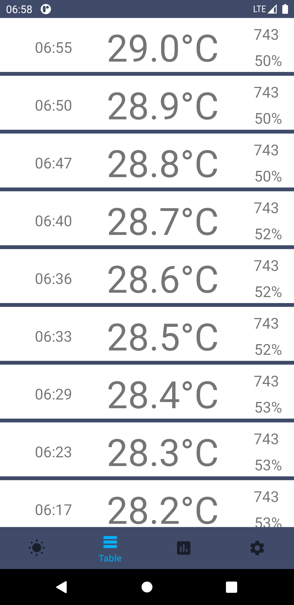

# WeatherStation

Weather application based on self made Arduino weather station with Raspberry Pi Rest api server

### Key tech
+ MVVM
+ Retrofit
+ RxKotlin
+ Room
+ MPAndroidChart
---
1. Indication screen. Background based on season (summer, autumn, winter, spring). Temp color changes

2. Table (RecyclerView)

  

3. Charts with selected time period in hours 

  

4. Settings

  
